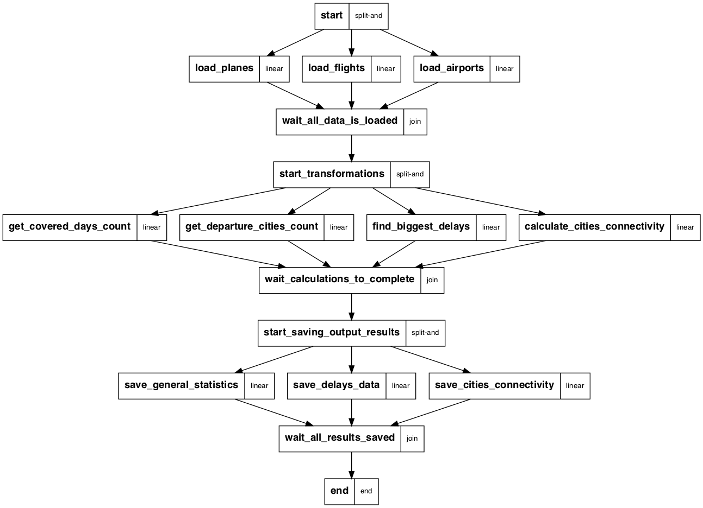

Data Engineering Exercise
==============================

# Description

1. Current project is a solution of a test exercise for data engineers which also includes some data analytics questions.

2. The task was used for gaining hands on experience with Metaflow. Metaflow is a newly open-sourced tool for building Data Engineering pipelines by Netflix.

3. The solution is structured applying best software development practices to a Data Science project according to [this article](https://www.thoughtworks.com/insights/blog/coding-habits-data-scientists)

# The task
Specified by [this document](Questions.md)

# The solution
Consists of
- Jupyter notebooks containing data exploration work.
- pipeline - a chain of transformations applied to input data in order to answer questions of the tasks.
- actual transformations and their tests!

### What is the pipeline?
It is an ETL. Nothing more then a chain (or acyclic graph) of 3 types of operations:
- Extract (data from some source)
- Transform (that data)
- Load (these data into the other source)

## Project structure
Project is structured according to the idea given in the [article](https://www.thoughtworks.com/insights/blog/coding-habits-data-scientists).

| Folder/File | Content |
|---|---|
|data| contains input data of the task stored locally for simplicity |
|notebooks| every data-related project always requires data exploration and analysis before actual implementation is started. Jupyter notebooks is the common tool for making this exploration. Since Jupyter is a separate instrument, different from usual programming routine it needs a separate place in the project. |
| pipeline.py | our main delivarable - the implementation of required ETL with Metaflow |
| transformations.py| logic of data transformations organized in small reusable functions |
| tests | every transformation has a test proving it's correctness!|

## Environment setup
### 1. Setup Data Science environment
The easiest way to get all the data science tools in one go is to install conda.

- brew cask install anaconda
- export PATH="/usr/local/anaconda3/bin:$PATH"

It will install own version of python with all required packages and tools.

Make sure that your system now has this python as default: `/usr/local/anaconda3/bin/python`

The easiest way for a developer to work in that new environment is to use `VSCode` with `Python extension` installed. Latest versions of this extension are executing `Jupyter` notebooks out of the box.
Executing any piece of python code, **make sure you are using anaconda's python**.

### 2. Setup metaflow
Using anaconda's python simply execute:

`pip install metaflow`

## Running the solution
Steps of notebooks must just run from VSCode with our setup.

### Execute pipeline
- From project's root
- `python pipeline.py run`

### Additional: Redraw the graph of the pipeline
Make sure you have [GraphViz installed in anaconda](https://anaconda.org/anaconda/graphviz).

- From project's root
- `python pipeline.py output-dot | dot -Grankdir=TB -Tpng -o graph.png`